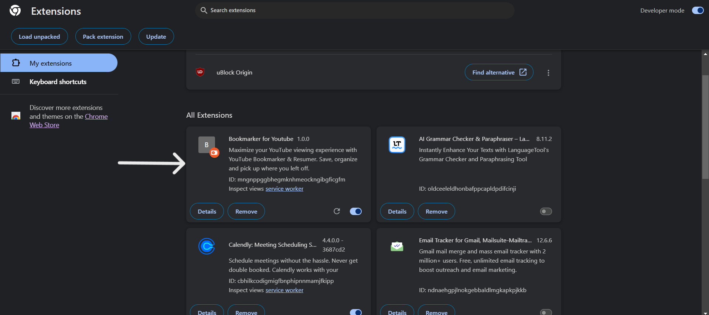
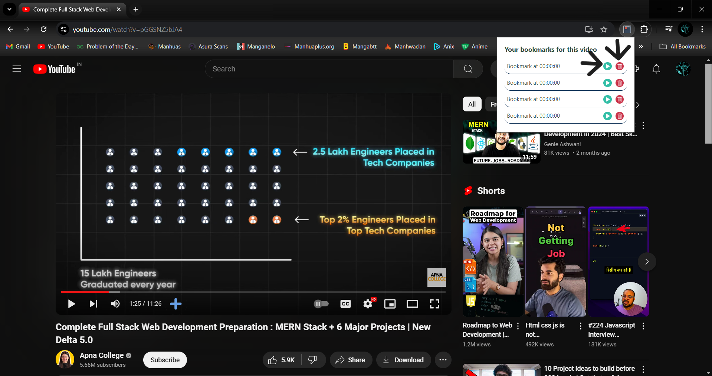

# Bookmarker for Youtube
Maximize your YouTube viewing experience with YouTube Bookmarker & Resumer. Save, organize and pick up where you left off.

## Features
* Save your favorite timestamps
* Each timestamp is stored with the video until you remove them

## About
The Bookmarker for Youtube extension helps you save time when watching a YouTube Video. It makes every video on YouTube behave like a book where you can easily bookmark a specific spot. After bookmarking a spot you can easily navigate to this individual timestamp whenever you want.   

## Installation
Currently the extension is not available on the Chrome Web Store.  
To download and install it you have to follow these steps:
1. Make sure <b>you have Google Chrome installed</b> on your computer. The extension <b>will not run</b> on other browsers. Download Chrome [HERE](https://www.google.com/chrome/?brand=JJTC&gclid=CjwKCAjwh-CVBhB8EiwAjFEPGWBaOaQ9LG5rsIbJgZUnCLCSpGf9A2d5NhNmskwjCH0lNp87Ifs0mBoCbsEQAvD_BwE&gclsrc=aw.ds)
 
2. Download this repository as a .zip file and extract it inside a folder. 
 
3. Open Google Chrome and click on the <i>Extensions Icon</i>. It is displayed as a small puzzle piece next to the search bar. 
 
4. This will bring up a popup window, find the <i>Manage Extensions</i> icon and click on it.  
5. This will open a new tab that will show you Chrome's Extensions Settings. Make sure you have the Developer Mode <i>enabled</i>.  
6. On this tab click <i>Load unpacked</i>.  
7. This will make you file browser popup. Select the folder where you extracted the extension and click <i>Select Folder</i>. 
8. You should now see the Bookmarker for Youtube extension appear.  

## How to Use
1. Navigate to YouTube and open a video. 
2. You should see the <i>Add Bookmark</i> Icon next to the left YouTube controls. Click on it to save the current timestamp.  
3. To view your saved bookmarks simply click on the extension icon next to Chrome's search bar.  
4. You can now view your Saved Bookmarks! 
5. Click on the <i>Play</i> icon, to instantly navigate to the selected bookmark, or click the <i>Delete</i> icon to delete a bookmark.  

## The Creation Process
I love to watch podcasts but many times I was losing my time looking for something in the video that caught my attention, also I needed to improve my skills with JavaScript, so I decided to build this extension. I hope you enjoy it!

## Notes
### This is a BETA version of the Extension and may not work 100% properly.
This is my first Chrome Extension. I hope you like it and find it useful. If you did, please give this repo a ⭐star.  
If you found a bug please either contact me or open an issue on GitHub.

## Contributing

Show your ❤️ and support by giving a ⭐. Any suggestions are welcome! Take a look at the contributing guide.

## Contact

If you wish to connect with me, you can reach out through the following channels:

  
  
  
  
  

© 2024 Chirag Khaitan
